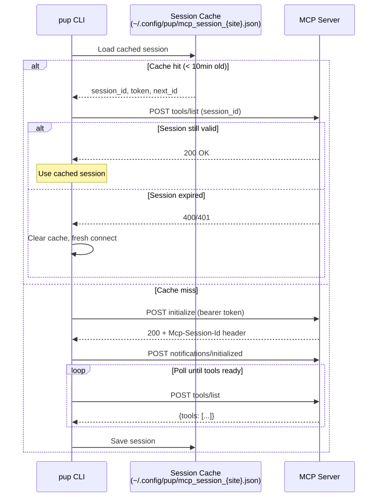

# MCP Proxy for Pup — Design Document

## Problem

Pup CLI and the Datadog MCP server both implement the same security findings tools — analysis, search, and schema discovery. This creates dual maintenance: prompts, field hints, and error guidance are duplicated across both systems, and changes require coordinated updates in two codebases.

## Solution

Proxy pup commands through the MCP server. Pup becomes a thin CLI skin over MCP tools, single-sourcing all tool logic.

```bash
pup mcp list-tools                                    # 41 tools available
pup mcp call security_findings_schema '{"...": ...}'  # call any tool
```

---

## Architecture



| Module | Purpose |
|--------|---------|
| **client.rs** | Streamable HTTP MCP client — session init, JSON-RPC 2.0 transport, session caching |
| **oauth.rs** | MCP OAuth 2.1 with DCR + PKCE, token storage, automatic refresh |
| **registry.rs** | Static map of pup command paths → MCP tool names + argument translators |

---

## Authentication

The MCP server has **its own OAuth 2.1 flow**, completely separate from pup's standard Datadog OAuth. This is the same flow Claude Code uses when connecting via `claude mcp add --transport http`.

The server publishes OAuth metadata at:
```
https://mcp.{site}/.well-known/oauth-authorization-server
```

### OAuth Endpoints

| Endpoint | URL |
|----------|-----|
| Dynamic Client Registration | `https://mcp.{site}/api/unstable/mcp-server/register` |
| Authorization | `https://mcp.{site}/api/unstable/mcp-server/authorize` |
| Token Exchange | `https://mcp.{site}/api/unstable/mcp-server/token` |

### Auth Flow


On first use:
1. Pup registers a client via DCR (one-time)
2. Generates a PKCE challenge and opens the browser
3. User authenticates through Datadog's login
4. Browser redirects back to localhost callback with auth code
5. Pup exchanges the code + PKCE verifier for an access token
6. Token is stored at `~/.config/pup/mcp_token_{site}.json` with `0600` permissions

On subsequent calls, the stored token is reused. If expired, the refresh token is used automatically. If that fails, the browser flow runs again.

### Why a separate OAuth flow?

Pup's existing Datadog OAuth token does not carry `mcp_read` permission. The MCP server's own OAuth flow grants the correct permissions — this is the same mechanism Claude Code uses. We discovered this when pup's bearer token could list tools but got 403 on `tools/call`.

---

## Session Management

The MCP server uses [Streamable HTTP](https://modelcontextprotocol.io/specification/2025-03-26/basic/transports#streamable-http) transport, requiring session initialization before tool calls.



### Fresh session (cold start)

1. `POST initialize` with protocol version and client info → server returns `Mcp-Session-Id` header
2. `POST notifications/initialized` → signals client is ready
3. Poll `POST tools/list` until tools appear (server loads toolsets asynchronously after init)

### Cached session (warm start)

Session state (ID, token, request counter) is cached at `~/.config/pup/mcp_session_{site}.json` with a 10-minute TTL. On reuse, a `tools/list` ping verifies liveness. If the server rejects it (400/401), the cache is cleared and a fresh session is established.

---

## Call Flow


1. User runs `pup mcp call <tool> <json>`
2. Client loads or establishes a session (cached or fresh)
3. Sends `tools/call` via JSON-RPC 2.0 with the session ID
4. MCP server calls the Datadog API internally
5. Response arrives as `{content: [{type: "text", text: "..."}]}`
6. Pup extracts text content and prints it

---

## Performance

Benchmarks comparing pup's direct API calls vs MCP proxy (n=10, session reuse enabled):

| Test | | avg | min | max | p50 |
|------|------|:---:|:---:|:---:|:---:|
| **Findings Schema** | pup (direct) | 2.9s | 2.6s | 3.2s | **2.8s** |
| | mcp (proxy) | 3.5s | 2.7s | 4.1s | **3.5s** |
| **Findings Search** | pup (direct) | 6.4s | 5.0s | 12.4s | **5.5s** |
| | mcp (proxy) | 7.3s | 5.2s | 9.4s | **6.6s** |
| **Rules List** | pup (direct) | 3.6s | 3.2s | 4.1s | **3.5s** |
| | mcp (proxy) | 3.9s | 3.7s | 4.0s | **3.8s** |

**Session reuse overhead: 0.3–1.1s** — just the extra network hop through the MCP server.

Without session reuse, cold start adds ~3–19s for session init + tool polling.

---

## Configuration

| Env var | Default | Purpose |
|---------|---------|---------|
| `PUP_MCP_ENDPOINT` | `https://mcp.{site}/api/unstable/mcp-server/mcp?toolsets=core,security` | Override the full MCP endpoint URL |
| `PUP_MCP_TOOLSETS` | `core,security` | Comma-separated toolsets to request |

### Token / session storage

| File | Contents | TTL |
|------|----------|-----|
| `~/.config/pup/mcp_token_{site}.json` | OAuth access + refresh token | Token expiry (~1h) |
| `~/.config/pup/mcp_client_{site}.json` | DCR client credentials | Permanent |
| `~/.config/pup/mcp_session_{site}.json` | Session ID + request counter | 10 minutes |

---

## Command Registry

Maps pup commands to MCP tools with argument translation. Currently registered:

| Pup command | MCP tool | Status |
|-------------|----------|--------|
| `security findings analyze` | `analyze_security_findings` | Registered, delegation TODO |
| `security findings search` | `search_security_findings` | Registered, delegation TODO |
| `security findings schema` | `security_findings_schema` | Registered, delegation TODO |

To add a new mapping, add an entry to `registry::lookup()` in `src/mcp/registry.rs`.

---

## Next Steps

1. **Wire security commands** — delegate `pup security findings *` through MCP when `PUP_MCP_ENABLED=1`
2. **Token refresh on 401** — retry with a fresh token if the server rejects mid-session
3. **Extend registry** — map additional pup command domains (logs, monitors, dashboards) to MCP tools
