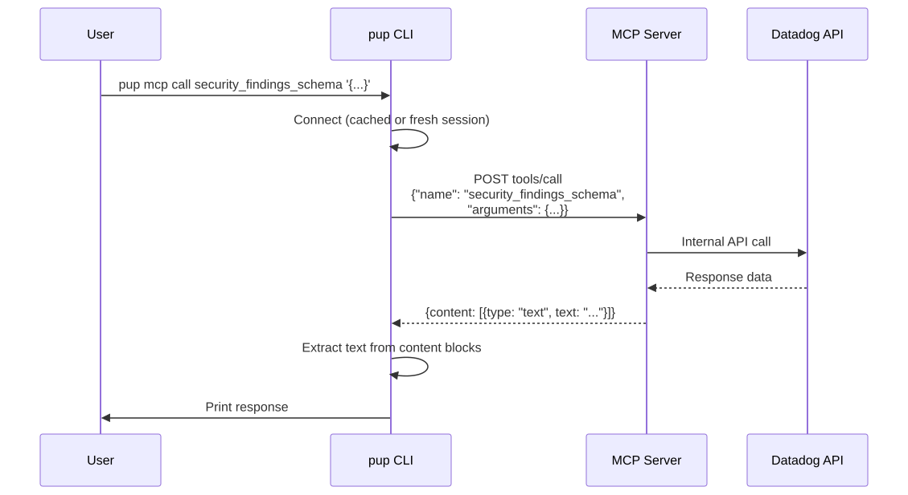
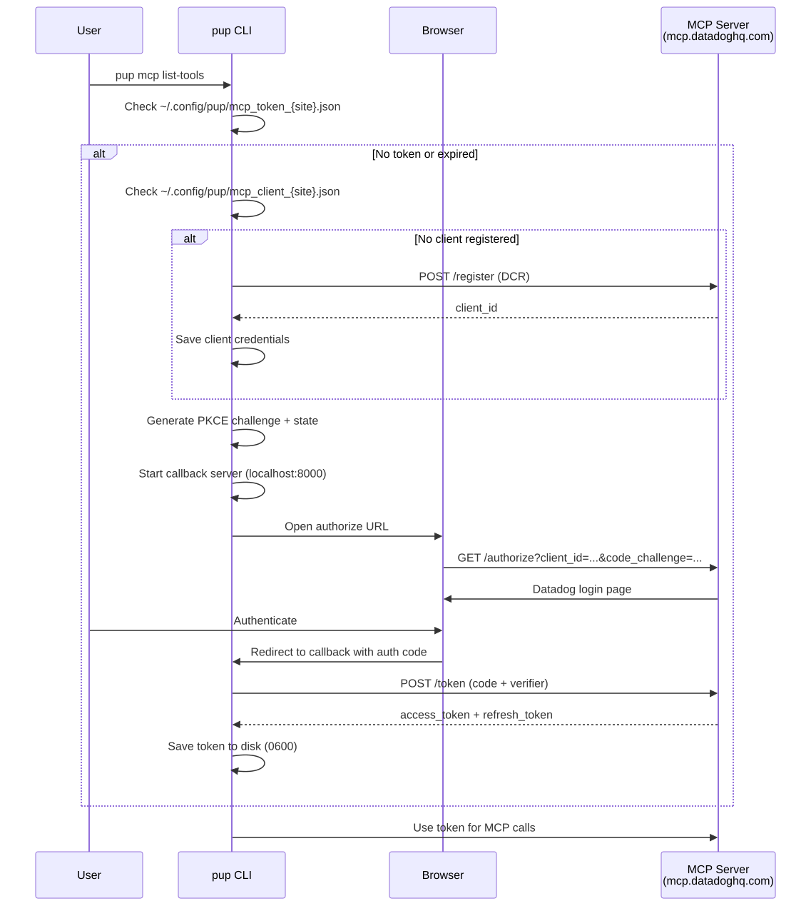

# MCP Proxy

Proxies pup commands through the Datadog MCP server (`mcp.{site}`) so tool logic is single-sourced. Instead of pup maintaining its own API call logic, prompts, and schemas for each command, it delegates to the MCP server — the same server that Claude Code and other AI tools use.

## Quick start

```bash
# List all available MCP tools (opens browser for auth on first run)
pup mcp list-tools

# Call any MCP tool directly
pup mcp call security_findings_schema '{"include_description": false, "telemetry": {"intent": "test"}}'

# Call with different toolsets
PUP_MCP_TOOLSETS=all pup mcp list-tools
```

## Architecture


| File | Purpose |
|------|---------|
| `client.rs` | Streamable HTTP MCP client — session init, JSON-RPC transport, session caching |
| `oauth.rs` | MCP OAuth 2.1 (DCR + PKCE + token storage + refresh) |
| `registry.rs` | Maps pup command paths to MCP tool names + argument translators |

## How a call works



1. User runs `pup mcp call <tool> <json>`
2. Client checks for a cached session (`~/.config/pup/mcp_session_{site}.json`)
3. If cached and valid, reuse it. If not, establish a fresh session (see below)
4. Send `tools/call` via JSON-RPC 2.0 with the session ID
5. Extract text content from the MCP response and print it

## Authentication

The MCP server has **its own OAuth 2.1 flow**, separate from pup's standard Datadog OAuth. This is the same flow Claude Code uses when you `claude mcp add --transport http`. The server publishes its OAuth metadata at:

```
https://mcp.{site}/.well-known/oauth-authorization-server
```



**Endpoints:**

| Endpoint | URL |
|----------|-----|
| Register (DCR) | `https://mcp.{site}/api/unstable/mcp-server/register` |
| Authorize | `https://mcp.{site}/api/unstable/mcp-server/authorize` |
| Token | `https://mcp.{site}/api/unstable/mcp-server/token` |

**Token storage:**

| File | Contents |
|------|----------|
| `~/.config/pup/mcp_token_{site}.json` | OAuth access + refresh token (0600 permissions) |
| `~/.config/pup/mcp_client_{site}.json` | DCR client credentials (client_id) |

On first use, pup registers a client via DCR, opens the browser for auth, exchanges the code for tokens via PKCE, and stores everything locally. Subsequent calls reuse the stored token, refreshing it automatically when expired.

## Session management

The MCP server uses [Streamable HTTP](https://modelcontextprotocol.io/specification/2025-03-26/basic/transports#streamable-http) transport, which requires session initialization before any tool calls.


**Fresh session** (cold start):
1. `POST initialize` — establishes session, server returns `Mcp-Session-Id` header
2. `POST notifications/initialized` — tells server the client is ready
3. Poll `tools/list` until tools appear (server loads toolsets asynchronously)

**Cached session** (warm start):
- Session ID, token, and request counter are cached at `~/.config/pup/mcp_session_{site}.json`
- TTL: 10 minutes
- On reuse, a `tools/list` ping verifies the session is still alive
- If the server rejects it (400/401), the cache is cleared and a fresh session is established

## Performance

Benchmarks comparing direct API calls vs MCP proxy (n=10, session reuse enabled):

| Test | | avg | min | max | p50 |
|------|------|:---:|:---:|:---:|:---:|
| **Findings Schema** | pup (direct) | 2.9s | 2.6s | 3.2s | 2.8s |
| | mcp (proxy) | 3.5s | 2.7s | 4.1s | 3.5s |
| **Findings Search** | pup (direct) | 6.4s | 5.0s | 12.4s | 5.5s |
| | mcp (proxy) | 7.3s | 5.2s | 9.4s | 6.6s |
| **Rules List** | pup (direct) | 3.6s | 3.2s | 4.1s | 3.5s |
| | mcp (proxy) | 3.9s | 3.7s | 4.0s | 3.8s |

Session reuse overhead: **0.3–1.1s** (the extra network hop through the MCP server).

Without session reuse, cold start adds ~3-19s for session init + tool polling.

## Configuration

| Env var | Default | Purpose |
|---------|---------|---------|
| `PUP_MCP_ENDPOINT` | `https://mcp.{site}/api/unstable/mcp-server/mcp?toolsets=core,security` | Override the full MCP endpoint URL |
| `PUP_MCP_TOOLSETS` | `core,security` | Comma-separated toolsets to request |

## Command registry

The registry (`registry.rs`) maps pup command paths to MCP tool names with argument translation functions. Currently registered:

| Pup command | MCP tool |
|-------------|----------|
| `security findings analyze` | `analyze_security_findings` |
| `security findings search` | `search_security_findings` |
| `security findings schema` | `security_findings_schema` |

To add a new mapping, add an entry to the `match` in `registry::lookup()`.

## TODO

- [ ] Wire security findings commands to delegate through MCP when enabled
- [ ] Token refresh on 401 retry
- [ ] Extend registry to other command domains (logs, monitors, etc.)
